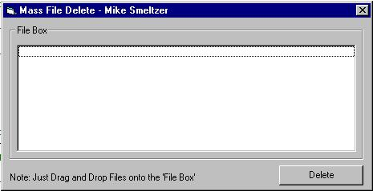



## Multiple File Delete

### Description

Deletes Multiple Files at one time. It uses Drag

and Drop to put the files into a listbox. If you

have any questions about this program just email

me at ourgroup@sprint.ca . I'd appreciate any feedback and please take the time to vote if you find this of any use. Thank You Very Much
 
### More Info
 
Be aware of what you delete

             |
---                |---
**Submitted On**   |2000-11-12 10:58:12
**By**             |[Mike Smeltzer](https://github.com/Planet-Source-Code/PSCIndex/blob/master/ByAuthor/mike-smeltzer.md)
**Level**          |Beginner
**User Rating**    |4.0 (8 globes from 2 users)
**Compatibility**  |VB 5\.0
**Category**       |[Files/ File Controls/ Input/ Output](https://github.com/Planet-Source-Code/PSCIndex/blob/master/ByCategory/files-file-controls-input-output__1-3.md)
**World**          |[Visual Basic](https://github.com/Planet-Source-Code/PSCIndex/blob/master/ByWorld/visual-basic.md)
**Archive File**   |[CODE\_UPLOAD1160811122000\.zip](https://github.com/Planet-Source-Code/mike-smeltzer-multiple-file-delete__1-12730/archive/master.zip)

